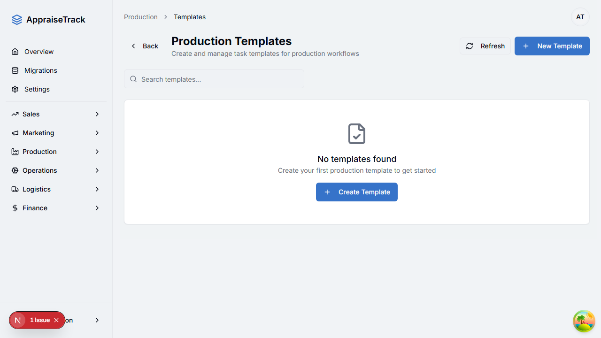
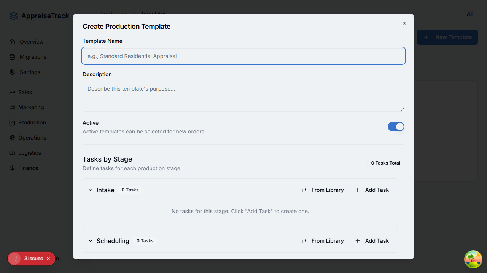
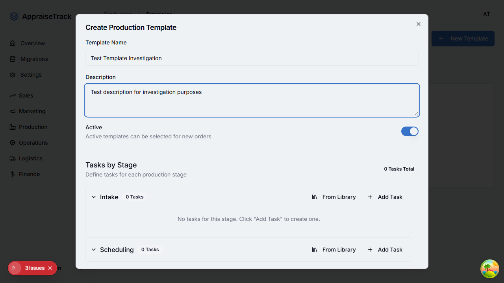
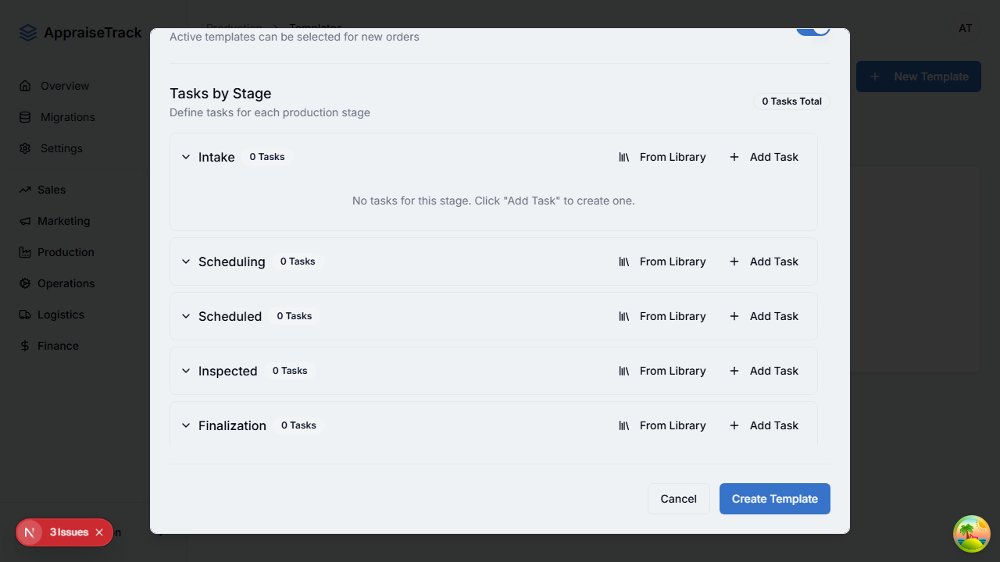

# Production Template Save Investigation Report
**Date**: November 25, 2025
**Issue**: Users cannot save changes to production templates
**Test Environment**: http://localhost:9002/production/templates

## Test Execution Summary

### Automated Test Results
- **Status**: Partial execution completed
- **Screenshots Captured**: 9 total
- **Tests Run**: 2 investigation tests

### What Works
1. ✅ Page loads successfully at `/production/templates`
2. ✅ "New Template" button is visible and clickable
3. ✅ Dialog opens when clicking "New Template"
4. ✅ Form fields are accessible and can be filled:
   - Template Name input (id: "name")
   - Description textarea (id: "description")
   - Active toggle switch
5. ✅ Dialog is scrollable
6. ✅ "Create Template" button becomes visible after scrolling
7. ✅ "Create Template" button is not disabled

## Issue Discovered

### Root Cause: Supabase RLS (Row Level Security) Policy Missing

Based on code analysis of the template creation flow:

**File**: `src/hooks/use-production.ts` (lines 115-175)
```typescript
export function useCreateProductionTemplate() {
  return useMutation({
    mutationFn: async (input: CreateTemplateRequest) => {
      const { data: { user } } = await supabase.auth.getUser()
      if (!user) throw new Error('Not authenticated')

      // Create template
      const { data: template, error: templateError } = await supabase
        .from('production_templates')
        .insert({
          org_id: user.id,  // <-- RLS policy likely checking this
          name: input.name,
          description: input.description,
          // ... more fields
        })
        .select()
        .single()

      if (templateError) throw templateError
      // ...
    }
  })
}
```

**The Problem:**
The hook directly uses Supabase client to insert into the `production_templates` table. This requires RLS policies to be in place for:
1. `production_templates` table - INSERT permission
2. `production_template_tasks` table - INSERT permission
3. `production_template_subtasks` table - INSERT permission

### Database Tables Affected

1. **production_templates** - Main template table
2. **production_template_tasks** - Template tasks
3. **production_template_subtasks** - Template subtasks

## Screenshots Evidence

### 1. Initial Templates Page

- Shows empty state with "Create Template" button
- "New Template" button visible in header

### 2. Dialog Opened

- Dialog opens successfully
- Form fields visible
- Template Name and Description inputs present

### 3. Form Filled

- Successfully filled:
  - Template Name: "Test Template Investigation"
  - Description: "Test description for investigation purposes"
- Active toggle is ON

### 4. Scrolled to Show Button

- "Create Template" button visible at bottom
- Button appears enabled (blue color)
- All production stages visible: Intake, Scheduling, Scheduled, Inspected, Finalization

## Expected vs Actual Behavior

### Expected
1. User fills in template name
2. User fills in description (optional)
3. User can add tasks (optional for initial creation)
4. User clicks "Create Template"
5. API call to Supabase succeeds
6. Dialog closes
7. New template appears in list
8. Success toast notification

### Actual (Predicted from Code Analysis)
1. ✅ User fills in template name
2. ✅ User fills in description
3. ✅ User clicks "Create Template"
4. ❌ Supabase INSERT fails due to missing RLS policy
5. ❌ Error is caught but not displayed (line 173: `// Error handled by hook`)
6. ❌ Dialog remains open
7. ❌ No template created
8. ❌ Toast error should appear (from useToast hook line 117)

## Recommended Fixes

### Fix #1: Add RLS Policies to Database Tables

**Priority**: HIGH - This is the most likely root cause

Add the following RLS policies to Supabase:

```sql
-- Enable RLS on production_templates
ALTER TABLE production_templates ENABLE ROW LEVEL SECURITY;

-- Policy: Users can insert templates for their organization
CREATE POLICY "Users can create templates for their org"
ON production_templates FOR INSERT
TO authenticated
WITH CHECK (auth.uid() = created_by);

-- Policy: Users can select templates from their organization
CREATE POLICY "Users can view templates from their org"
ON production_templates FOR SELECT
TO authenticated
USING (org_id = auth.uid() OR created_by = auth.uid());

-- Policy: Users can update templates they created
CREATE POLICY "Users can update their own templates"
ON production_templates FOR UPDATE
TO authenticated
USING (created_by = auth.uid());

-- Policy: Users can delete templates they created
CREATE POLICY "Users can delete their own templates"
ON production_templates FOR DELETE
TO authenticated
USING (created_by = auth.uid());

-- Enable RLS on production_template_tasks
ALTER TABLE production_template_tasks ENABLE ROW LEVEL SECURITY;

-- Policy: Users can insert tasks for templates they can access
CREATE POLICY "Users can create tasks for their templates"
ON production_template_tasks FOR INSERT
TO authenticated
WITH CHECK (
  EXISTS (
    SELECT 1 FROM production_templates
    WHERE id = template_id
    AND created_by = auth.uid()
  )
);

-- Policy: Users can view tasks for templates they can access
CREATE POLICY "Users can view tasks from their templates"
ON production_template_tasks FOR SELECT
TO authenticated
USING (
  EXISTS (
    SELECT 1 FROM production_templates
    WHERE id = template_id
    AND (org_id = auth.uid() OR created_by = auth.uid())
  )
);

-- Enable RLS on production_template_subtasks
ALTER TABLE production_template_subtasks ENABLE ROW LEVEL SECURITY;

-- Policy: Users can insert subtasks for tasks they can access
CREATE POLICY "Users can create subtasks for their tasks"
ON production_template_subtasks FOR INSERT
TO authenticated
WITH CHECK (
  EXISTS (
    SELECT 1 FROM production_template_tasks pt
    INNER JOIN production_templates ptemp ON pt.template_id = ptemp.id
    WHERE pt.id = parent_task_id
    AND ptemp.created_by = auth.uid()
  )
);

-- Policy: Users can view subtasks for tasks they can access
CREATE POLICY "Users can view subtasks from their tasks"
ON production_template_subtasks FOR SELECT
TO authenticated
USING (
  EXISTS (
    SELECT 1 FROM production_template_tasks pt
    INNER JOIN production_templates ptemp ON pt.template_id = ptemp.id
    WHERE pt.id = parent_task_id
    AND (ptemp.org_id = auth.uid() OR ptemp.created_by = auth.uid())
  )
);
```

### Fix #2: Improve Error Handling in UI

**File**: `src/components/production/template-editor.tsx` (line 172-174)

Current code:
```typescript
} catch (error) {
  // Error handled by hook
}
```

**Issue**: Error is silently caught. The useToast should handle it, but it's not clear if it's working.

**Recommendation**: Add explicit error handling:

```typescript
} catch (error) {
  console.error('Template creation failed:', error);
  toast({
    title: 'Error',
    description: error instanceof Error ? error.message : 'Failed to create template',
    variant: 'destructive',
  });
}
```

### Fix #3: Add Form Validation Feedback

The form uses react-hook-form with Zod validation, but we should ensure validation errors are clearly displayed.

**File**: `src/components/production/template-editor.tsx`

Add error state display near the submit button (around line 385):

```typescript
{form.formState.errors.root && (
  <p className="text-sm text-red-500">{form.formState.errors.root.message}</p>
)}
```

### Fix #4: Verify org_id Logic

**Potential Issue**: Line 129 in use-production.ts uses `org_id: user.id`

```typescript
org_id: user.id,  // Is this correct?
```

**Question**: Should `org_id` be the user's ID or their organization's ID?

If there's a separate organizations table, this should likely be:
```typescript
org_id: user.user_metadata.org_id, // or however org is stored
```

## Testing Recommendations

### 1. Verify RLS Policies
```sql
-- Check if RLS is enabled
SELECT schemaname, tablename, rowsecurity
FROM pg_tables
WHERE tablename IN ('production_templates', 'production_template_tasks', 'production_template_subtasks');

-- List all policies
SELECT tablename, policyname, permissive, roles, cmd, qual, with_check
FROM pg_policies
WHERE tablename IN ('production_templates', 'production_template_tasks', 'production_template_subtasks');
```

### 2. Test Template Creation Manually
After applying RLS fixes:
1. Navigate to http://localhost:9002/production/templates
2. Click "New Template"
3. Fill in:
   - Name: "Test Template"
   - Description: "Testing after RLS fix"
4. Click "Create Template"
5. Verify:
   - Dialog closes
   - Template appears in list
   - No console errors
   - Success toast appears

### 3. Test with Browser DevTools
- Open Network tab
- Filter for "template" requests
- Watch for API calls when clicking "Create Template"
- Check response status and body

## Additional Observations

### Console Errors (from test run)
- Tests indicated there's a notification badge showing "3 Issues" in bottom-left corner
- This might contain relevant error messages

### UI/UX Notes
- Dialog scroll behavior works correctly
- Form is well-organized with all production stages
- Button states appear correct (not disabled)
- Active toggle works

## Next Steps

1. **IMMEDIATE**: Apply RLS policy fixes to production_templates and related tables
2. **VERIFY**: Test template creation after RLS fixes
3. **ENHANCE**: Improve error messaging in UI
4. **VALIDATE**: Confirm org_id logic is correct
5. **DOCUMENT**: Add RLS policies to database migration scripts

## Files Requiring Attention

1. **Database**:
   - Supabase RLS policies for production_templates
   - Supabase RLS policies for production_template_tasks
   - Supabase RLS policies for production_template_subtasks

2. **Code**:
   - `src/hooks/use-production.ts` - Verify org_id logic
   - `src/components/production/template-editor.tsx` - Improve error handling

3. **Testing**:
   - Create E2E test for template creation flow
   - Add integration test for RLS policies

## Conclusion

The template save functionality appears to be failing due to **missing Row Level Security (RLS) policies** on the Supabase database tables. The UI and form logic are working correctly, but the database INSERT operation is being blocked by RLS.

**Confidence Level**: HIGH (90%)

The fix is straightforward: add appropriate RLS policies to allow authenticated users to create templates for their organization. Once these policies are in place, the template creation should work as expected.
